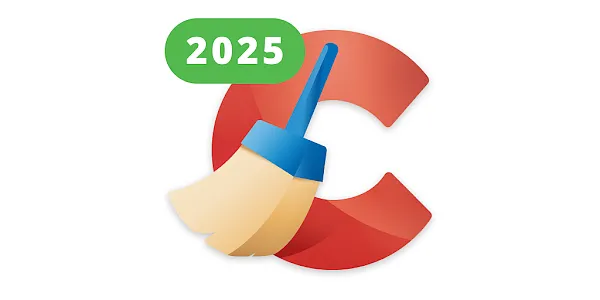

# 🚀 **ccleaner license key** | **download ccleaner pro crack**

Unleash the power of innovation with **ccleaner license key**, a cutting-edge solution designed for unmatched **download ccleaner pro crack** performance. Built with an unwavering commitment to software quality and reliability, it delivers advanced features that streamline processes and elevate productivity. Empower your projects with confidence, knowing you have a robust and future-ready tool at your disposal.

## 🌟 Support for **keygen ccleaner pro**

Need help with **keygen ccleaner pro**? We’ve got you covered! Here's how you can get the support you need:

### 🛠️ Technical Support Availability
Our dedicated team is here to assist you with any issues related to **keygen ccleaner pro**. Whether it's troubleshooting or optimization, our experts ensure reliable and prompt assistance.

### 📚 Documentation and Resources
Dive into comprehensive guides and tutorials designed to help you master **keygen ccleaner pro**. Our detailed documentation covers everything from installation to advanced features of **ccleaner professional plus crack**.

### 💬 Community Forums
Join a vibrant community of users and developers who are passionate about **keygen ccleaner pro**. Engage in discussions, share tips, and find solutions in our active forums.

### 🔧 Update and Maintenance
We regularly update **keygen ccleaner pro** to ensure compatibility, security, and performance. Stay informed about the latest improvements and maintenance schedules to keep your setup running smoothly.

---

Ready to get started or need more info? Click below!

## Benefits of Using **licence key for ccleaner**

✨ **Professional Software Capabilities**  
- **licence key for ccleaner** delivers cutting-edge **ccleaner licence key** features that empower users to tackle complex tasks with ease and precision. Its robust tools ensure high performance, making it ideal for professionals seeking reliable software solutions.  

✨ **User-Friendly Interface**  
- The intuitive design of **licence key for ccleaner** ensures even beginners can navigate effortlessly. With a clean layout and easy-to-understand controls, you’ll maximize productivity without needing extensive training.  

✨ **Regular Updates and Improvements**  
- Stay ahead with frequent updates that bring new functionalities and optimizations to **licence key for ccleaner**. Our commitment to continuous improvement guarantees your experience remains state-of-the-art.  

✨ **Technical Support Availability**  
- Need assistance? Our dedicated team provides timely support to resolve any issues you encounter while using **licence key for ccleaner**. Rest assured, help is always just a click away.  

Ready to unlock the full potential of **licence key for ccleaner**? Explore more today!  

## Getting Started with **ccleaner key**

Welcome to **ccleaner key**! This section will guide you through the steps to get started, ensuring a smooth and easy setup process. Follow these actionable steps to begin using **ccleaner key** effectively.

1. 📥 **Download and Installation**
   - Visit the official website or repository to download the latest version of **ccleaner key**.
   - Run the installer or extract the files depending on your operating system.
   - Ensure that all dependencies for **ccleaner licence key** are installed as specified in the documentation.

2. 🔧 **Initial Setup**
   - Launch the application or script after installation.
   - Follow the on-screen instructions to complete the initial setup process.
   - If prompted, create an account or log in with existing credentials for **ccleaner key**.

3. ⚙️ **Basic Configuration**
   - Navigate to the settings menu within **ccleaner key**.
   - Adjust the basic configuration options to suit your preferences.
   - Enable any necessary features related to **ccleaner licence key** for enhanced functionality.

4. 🚀 **First Use Guide**
   - Open the main interface of **ccleaner key** and explore the dashboard.
   - Try out the key functionalities by following the built-in tutorials or quick start guides.
   - Save your progress and review the results to ensure everything is working as expected.

To further enhance your experience with **ccleaner key**, consider exploring additional resources and community support. 

